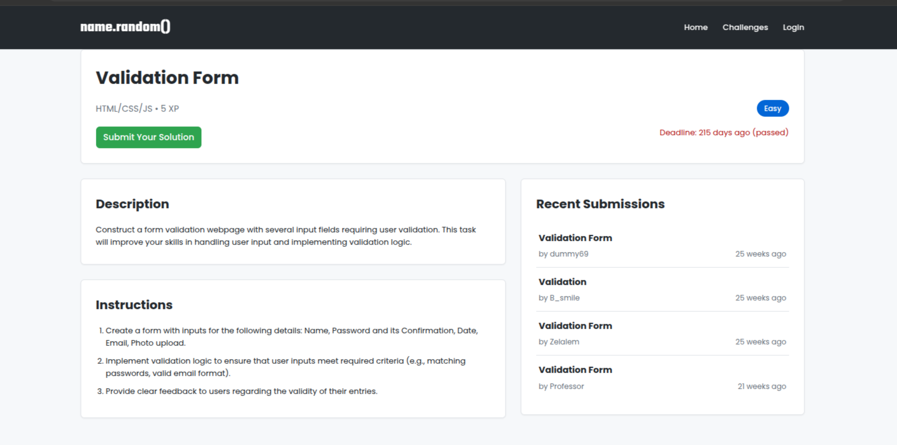
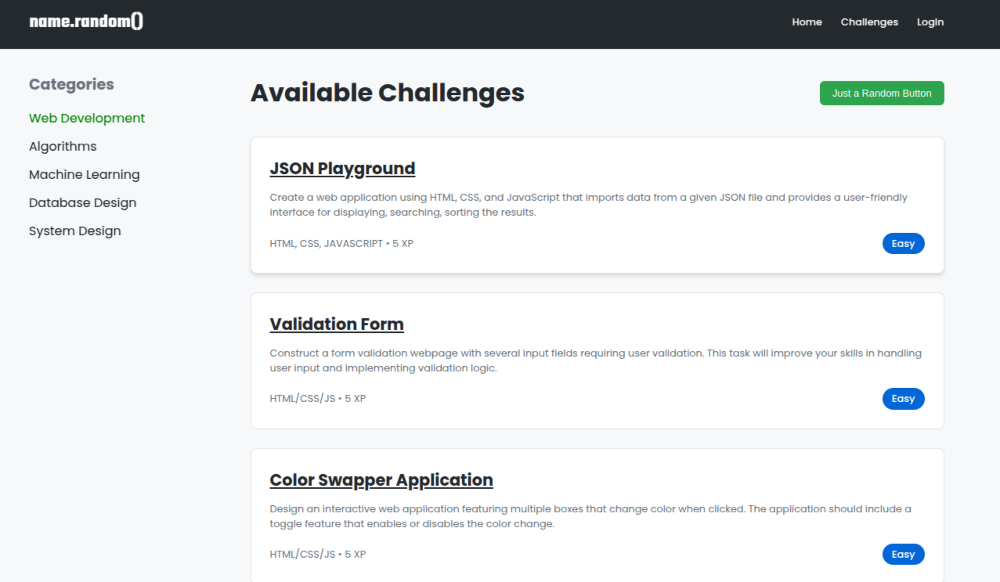

# name.random()

Welcome to **name.random()**, a platform built exclusively for our group of passionate coders. This is not just a website; it’s a space where we, as a community, come together to share, learn, and grow through our love for coding.

## Purpose

This platform was created to serve as a hub for our group to:

- **Showcase Our Projects**: Upload and present the projects we’ve worked hard on, allowing others in the group to see and appreciate our efforts.
- **Rate and Review**: Provide constructive feedback on each other’s work, helping us all improve and refine our skills.
- **Collaborate and Inspire**: Use this space to inspire one another, collaborate on ideas, and push the boundaries of what we can achieve together.
- **Track Progress**: Keep a record of our contributions and see how far we’ve come as individuals and as a group.

## Why We Built This

We believe that coding is more than just writing lines of code—it’s about creativity, problem-solving, and community. **name.random()** is our way of fostering that community spirit. It’s a place where we can celebrate our achievements, learn from each other, and continue to grow as developers.

## How It Works

- Members of our group can log in to the platform to upload their projects.
- Each project can be rated and reviewed by other members, providing valuable feedback.
- The platform also serves as a repository of our collective work, showcasing the incredible talent within our group.

## Live Platform

Our platform is live and ready for use! Visit it here: [name.random()](https://the-name-random.vercel.app)

---
### More Preview

---

This platform is a testament to our shared passion for coding and our commitment to supporting one another. Let’s continue to build, learn, and grow together!